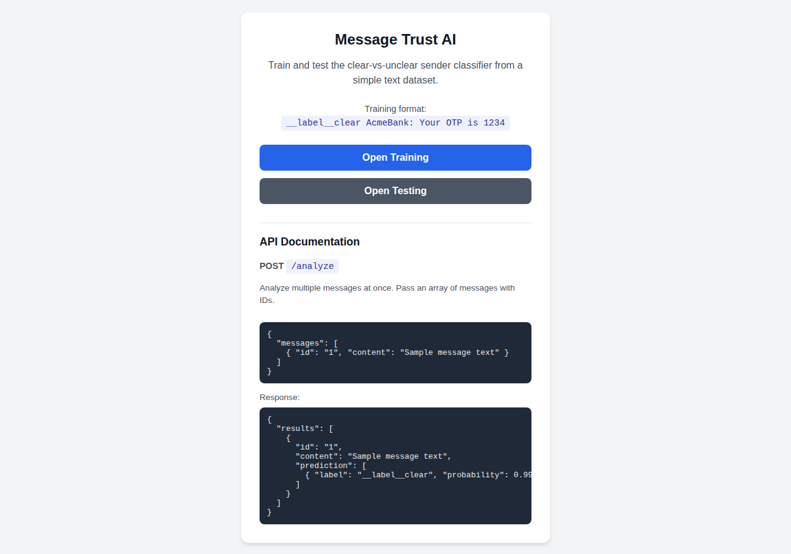
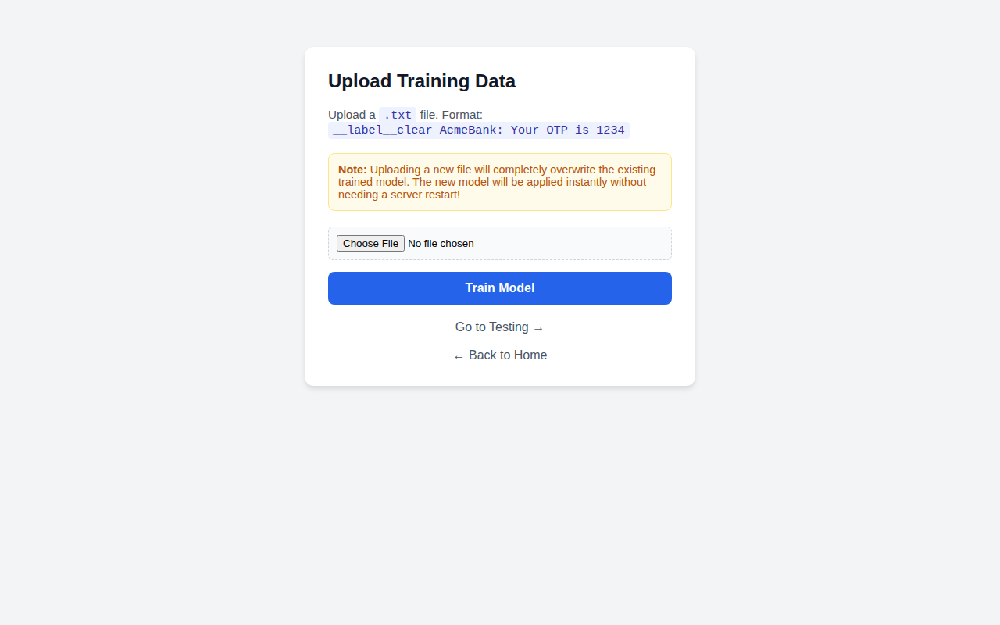
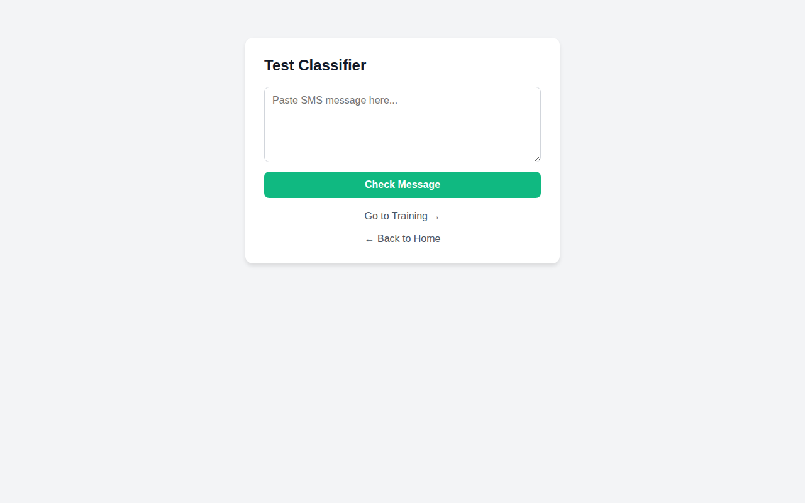

# Message Trust AI Platform

A fast, lightweight, and responsive AI classification platform designed to determine whether an SMS message sender is "clear" (legitimate) or "unclear" (spam/suspicious). Built with FastAPI, FastText, and Docker.

## Features
- **Train Custom Models:** Easily upload `.txt` training files to replace and retrain the classification model on the fly.
- **Instant Testing:** Web interface to paste SMS messages and receive instant JSON predictions.
- **Bulk Analysis API:** A dedicated REST endpoint to analyze multiple messages simultaneously.
- **Persistent Storage:** Models are saved to the host filesystem using Docker volumes, surviving container restarts.
- **Mobile-Friendly UI:** Clean, modern, responsive card-based design.

## Screenshots

### Home & API Documentation


### Training Interface


### Testing Interface


## Installation & Running (Docker)

1. Clone the repository.
2. Build and start the container:
   ```bash
   docker compose up -d --build
   ```
3. Access the platform at `http://localhost:8093`

## API Usage

### Bulk Analysis
**Endpoint:** `POST /analyze`

**Request Body Example:**
```json
{
  "messages": [
    { "id": "1", "content": "AcmeBank: Your OTP is 1234" },
    { "id": "2", "content": "You have won a free iPhone click here" }
  ]
}
```

**Response Example:**
```json
{
  "results": [
    {
      "id": "1",
      "content": "AcmeBank: Your OTP is 1234",
      "prediction": [
        { "label": "__label__clear", "probability": 0.9998 },
        { "label": "__label__unclear", "probability": 0.0001 }
      ]
    }
  ]
}
```
